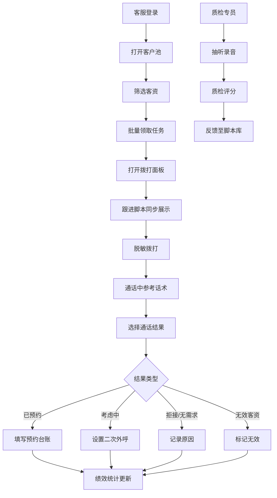

# 医美私域客资跟进系统 - 产品需求文档 (PRD)

## 1. 产品概述

医美私域客资跟进桌面端是为院内客服中心和电销团队打造的客户关系管理系统，专注于批量线索处理、标准化通话节奏和精细化质检复盘。系统通过 6 大核心窗口协同工作，实现从客资领取、拨打跟进、预约转化到绩效统计的全流程闭环管理，提升医美机构电销转化效率和服务合规性。

- **目标用户**：医美机构客服人员、电销团队、质检专员、运营主管
- **核心价值**：标准化跟进流程、提升拨打效率、保障服务合规、数据驱动运营

---

## 2. 核心功能

### 2.1 用户角色

| 角色 | 注册方式 | 核心权限 |
|------|----------|----------|
| 客服/电销人员 | 工号登录 | 领取客资、拨打电话、填写跟进记录、查看个人数据 |
| 质检专员 | 工号登录 | 抽听录音、质检评分、问题反馈、脚本库维护 |
| 运营主管 | 工号登录 | 全量数据查看、团队绩效统计、客资分配管理 |

### 2.2 功能模块

系统由 6 个核心窗口组成，可独立打开或多窗口联动：

1. **拨打面板**：号码脱敏拨打、通话计时、通话结果选择、拒绝原因记录、意向项目补全
2. **客户池**：线索批量领取、客资筛选（按渠道/项目/时间）、任务分配、无效客资标记
3. **跟进脚本**：标准话术提示、客户来源展示、广告承诺同步、实时提醒
4. **质检抽听**：录音抽检、违规承诺提醒、质检评分、问题反馈到脚本库
5. **预约台账**：预约院区选择、咨询师交接备注、到店确认、预约状态管理
6. **绩效统计**：个人外呼漏斗、团队对比、转化分析、质检得分

### 2.3 页面详情

| 页面名称 | 模块名称 | 功能描述 |
|----------|----------|----------|
| 拨打面板 | 号码展示区 | 脱敏号码显示（138****1234）、一键拨打、挂断按钮 |
| 拨打面板 | 通话控制区 | 通话计时、静音、录音开关、拨号键盘 |
| 拨打面板 | 结果记录区 | 通话结果下拉（已预约/考虑中/拒接/无需求/关机/空号）、下一步排程 |
| 拨打面板 | 意向补全区 | 意向项目多选、预算范围、到店时间偏好 |
| 客户池 | 筛选区 | 渠道筛选（抖音/小红书/百度/美团/转介绍）、项目筛选、时间范围、领取状态 |
| 客户池 | 客资列表 | 批量勾选、批量领取/释放、客户标签、联系次数、最后跟进时间 |
| 客户池 | 任务概览 | 今日待拨打、已拨打、已预约、转化率数据卡片 |
| 跟进脚本 | 话术展示区 | 开场白、项目介绍、异议处理、邀约话术（按阶段切换） |
| 跟进脚本 | 客户情报 | 客户来源、广告落地页、点击关键词、历史沟通记录 |
| 跟进脚本 | 承诺提示 | 广告承诺合规提醒、不能承诺的疗效警示 |
| 质检抽听 | 录音列表 | 按人员/转化率/时间筛选录音、支持搜索 |
| 质检抽听 | 播放器 | 波形图、倍速播放、逐句点评、打标功能 |
| 质检抽听 | 质检项 | 夸大疗效/遗漏风险/服务态度/合规性评分项 |
| 预约台账 | 预约列表 | 院区筛选、日期筛选、咨询师筛选、预约状态 |
| 预约台账 | 详情卡片 | 客户信息、预约项目、咨询师交接备注、到店确认按钮 |
| 绩效统计 | 外呼漏斗 | 线索数→拨打数→接通数→意向数→预约数→到店数 转化漏斗 |
| 绩效统计 | 个人榜单 | 拨打量、接通率、预约率、质检得分排名 |
| 绩效统计 | 趋势分析 | 日/周/月趋势图、渠道转化对比 |

---

## 3. 核心流程

### 3.1 客服外呼主流程

客服登录系统 → 打开客户池 → 按渠道/项目筛选客资 → 批量领取今日任务 → 打开拨打面板 → 同步展示跟进脚本（含客户来源、广告承诺、开场白）→ 点击拨打（号码脱敏）→ 通话中参考标准话术 → 通话结束选择结果（已预约/考虑中/拒接/无需求等）→ 填写拒绝原因或意向项目 → 设置二次外呼排程 → 数据自动同步绩效统计

### 3.2 质检工作流程

质检专员登录 → 打开质检抽听窗口 → 按低转化率人员筛选录音 → 抽检播放录音 → 核对是否夸大疗效、是否遗漏风险提示 → 逐项打分 → 标注问题类型 → 反馈问题到脚本库 → 生成质检报告

### 3.3 预约管理流程

客服标记"已预约"→ 自动跳转预约台账 → 选择预约院区和时间 → 选择对接咨询师 → 填写客户特殊需求和交接备注 → 提交预约 → 咨询师在台账中查看 → 到店后确认状态

---

## 4. 用户界面设计

### 4.1 设计风格

**设计方向**：专业医疗风 + 高效工具感

- **主色调**：深青色 `#0F766E`（专业、信任）+ 玫瑰金 `#E8B4A0`（医美温度）
- **辅助色**：健康绿 `#10B981`（已预约/成功）、警示橙 `#F59E0B`（考虑中/待跟进）、冷静灰 `#64748B`（中性信息）
- **背景色**：多层级灰阶 `#F8FAFC` / `#F1F5F9` / `#E2E8F0`，营造清晰的信息层级
- **按钮风格**：圆角 6px，微微投影，主按钮深青色填充，次按钮描边
- **字体**：Noto Sans SC（正文）+ 思源宋体（数据展示，增强专业感）
- **布局风格**：多窗口卡片式布局，支持窗口拖拽和联动，顶部全局导航
- **图标风格**：线性图标 + 填充图标结合，统一 2px 线宽

### 4.2 页面设计概述

| 页面名称 | 模块名称 | UI 要素 |
|----------|----------|---------|
| 拨打面板 | 整体布局 | 左侧客户信息卡 + 中间拨号区 + 右侧结果记录区，紧凑布局，减少鼠标移动距离 |
| 拨打面板 | 拨号区 | 大号脱敏号码展示（32px），圆形拨打按钮，波形动画表示通话中 |
| 客户池 | 列表区 | 高密度数据表格，斑马纹，行悬浮高亮，左侧批量复选框 |
| 客户池 | 筛选区 | 胶囊式筛选标签，支持多选，顶部固定 |
| 跟进脚本 | 话术区 | 分阶段 Tab 切换，当前话术高亮放大，关键词彩色标注 |
| 跟进脚本 | 客户情报 | 信息卡式布局，来源渠道带对应品牌色标识 |
| 质检抽听 | 播放器 | 深色播放器风格，波形图可视化，进度条可打点标记 |
| 质检抽听 | 评分区 | 星级评分 + 问题标签快速选择，提交按钮明显 |
| 预约台账 | 列表区 | 日历视图 + 列表视图切换，院区用不同色块区分 |
| 绩效统计 | 漏斗图 | 渐变填充漏斗，每层显示数量和转化率，鼠标悬浮显示详情 |
| 绩效统计 | 榜单区 | 前三名头像+奖牌，数据用大号字体展示 |

### 4.3 响应式

- **桌面端优先**：针对 1920×1080 及以上分辨率优化，最小支持 1366×768
- **多窗口支持**：6 个窗口可独立弹出或在主界面内 Tab 切换，支持双屏扩展
- **高密度信息**：表格行高 40px，确保一屏展示更多数据，减少滚动
- **触控优化**：按钮最小尺寸 36px×36px，关键操作按钮 48px

### 4.4 动效设计

- **拨打动效**：点击拨打按钮时，按钮外圈脉冲涟漪动画
- **通话中**：波形条上下跳动，计时数字渐变增长
- **数据更新**：数字变化时滚动计数动画
- **窗口切换**：平滑淡入淡出 200ms
- **悬停反馈**：表格行、按钮、卡片有明确的背景色变化过渡
