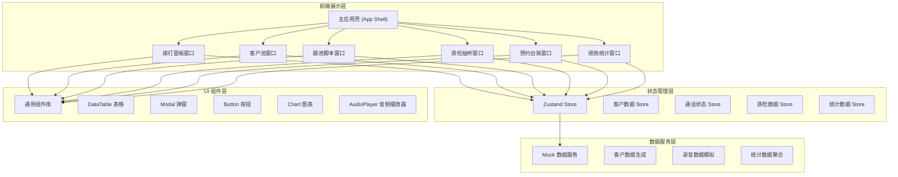
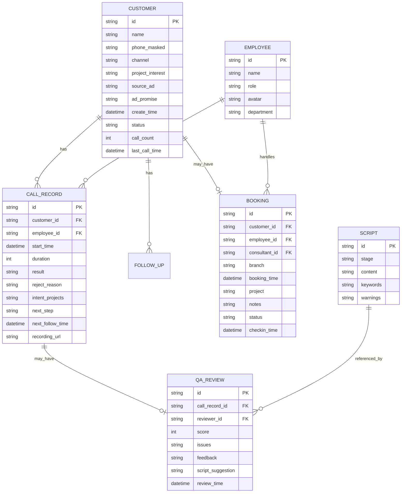

# 医美私域客资跟进系统 - 技术架构文档

## 1. 架构设计



## 2. 技术描述

- **前端框架**：React 18 + TypeScript 5
- **构建工具**：Vite 5
- **样式方案**：TailwindCSS 3 + CSS Variables（主题系统）
- **状态管理**：Zustand 4（轻量级状态管理，适合多窗口间数据共享）
- **图表库**：Recharts 2（漏斗图、趋势图、柱状图）
- **图标库**：Lucide React（线性图标，符合专业医疗风格）
- **音频播放**：HTML5 Audio API + 自定义波形可视化
- **日期处理**：dayjs
- **后端服务**：无后端，全部使用 Mock 数据模拟
- **数据持久化**：localStorage 保存用户操作记录

## 3. 路由定义

由于是桌面端多窗口应用，采用单页应用 + 窗口管理模式，不使用传统路由：

| 窗口标识 | 窗口名称 | 用途 |
|----------|----------|------|
| dial-panel | 拨打面板 | 外呼拨打、通话控制、结果记录 |
| customer-pool | 客户池 | 客资筛选、批量领取、无效标记 |
| follow-script | 跟进脚本 | 标准话术、客户情报、合规提示 |
| qa-review | 质检抽听 | 录音播放、质检评分、问题反馈 |
| booking-ledger | 预约台账 | 预约管理、咨询师交接、到店确认 |
| performance | 绩效统计 | 外呼漏斗、团队榜单、趋势分析 |

## 4. 数据模型

### 4.1 实体关系图



### 4.2 核心数据类型定义

```typescript
// 客户信息
interface Customer {
  id: string;
  name: string;
  phoneMasked: string;
  channel: 'douyin' | 'xiaohongshu' | 'baidu' | 'meituan' | 'referral';
  projectInterest: string[];
  sourceAd: string;
  adPromise: string;
  createTime: string;
  status: 'new' | 'following' | 'booked' | 'invalid';
  callCount: number;
  lastCallTime?: string;
  tags: string[];
  claimedBy?: string;
}

// 通话记录
interface CallRecord {
  id: string;
  customerId: string;
  employeeId: string;
  startTime: string;
  duration: number;
  result: 'booked' | 'considering' | 'rejected' | 'no_answer' | 'no_need' | 'off' | 'invalid';
  rejectReason?: string;
  intentProjects?: string[];
  budget?: string;
  nextStep?: string;
  nextFollowTime?: string;
  recordingUrl?: string;
}

// 预约信息
interface Booking {
  id: string;
  customerId: string;
  employeeId: string;
  consultantId: string;
  branch: 'main' | 'branch1' | 'branch2';
  bookingTime: string;
  project: string;
  notes: string;
  status: 'pending' | 'confirmed' | 'checked_in' | 'cancelled';
  checkinTime?: string;
}

// 质检记录
interface QAReview {
  id: string;
  callRecordId: string;
  reviewerId: string;
  score: number;
  dimensions: {
    exaggeration: number;
    riskDisclosure: number;
    attitude: number;
    compliance: number;
  };
  issues: string[];
  feedback: string;
  scriptSuggestion?: string;
  reviewTime: string;
}

// 员工信息
interface Employee {
  id: string;
  name: string;
  role: 'agent' | 'qa' | 'manager';
  avatar: string;
  department: string;
}

// 话术脚本
interface Script {
  id: string;
  stage: 'opening' | 'intro' | 'objection' | 'invitation' | 'closing';
  title: string;
  content: string;
  keywords: string[];
  warnings: string[];
}
```

## 5. 目录结构

```
src/
├── components/          # 通用组件
│   ├── ui/             # 基础 UI 组件 (Button, Modal, Table 等)
│   ├── layout/         # 布局组件 (Window, Dock, Navigation)
│   └── shared/         # 业务共享组件 (CustomerCard, CallTimer 等)
├── stores/             # Zustand 状态管理
│   ├── customerStore.ts
│   ├── callStore.ts
│   ├── qaStore.ts
│   └── statsStore.ts
├── windows/            # 6 个核心窗口组件
│   ├── DialPanel/
│   ├── CustomerPool/
│   ├── FollowScript/
│   ├── QAReview/
│   ├── BookingLedger/
│   └── Performance/
├── data/               # Mock 数据
│   ├── customers.ts
│   ├── calls.ts
│   ├── bookings.ts
│   ├── employees.ts
│   └── scripts.ts
├── hooks/              # 自定义 Hooks
│   ├── useCallTimer.ts
│   └── useWindowManager.ts
├── types/              # TypeScript 类型定义
│   └── index.ts
├── utils/              # 工具函数
│   ├── format.ts
│   └── mock.ts
├── App.tsx
├── main.tsx
└── index.css
```

## 6. 窗口管理设计

系统采用多窗口（Multi-Window）设计，通过 WindowManager 统一管理：

- **主窗口**：顶部全局导航 + 底部 Dock 栏，显示当前打开的窗口
- **子窗口**：每个功能模块为独立可拖拽窗口，支持最小化、最大化、关闭
- **窗口联动**：拨打面板选择客户后，跟进脚本窗口自动切换到对应客户的话术
- **持久化**：窗口位置、大小、打开状态保存到 localStorage

## 7. 性能优化

- 客户池虚拟滚动：使用 react-window 处理 10000+ 条数据
- 图表按需渲染：绩效统计图表组件懒加载
- 状态分片：Zustand 使用 selector 避免不必要的重渲染
- 防抖节流：搜索、筛选操作添加 300ms 防抖
